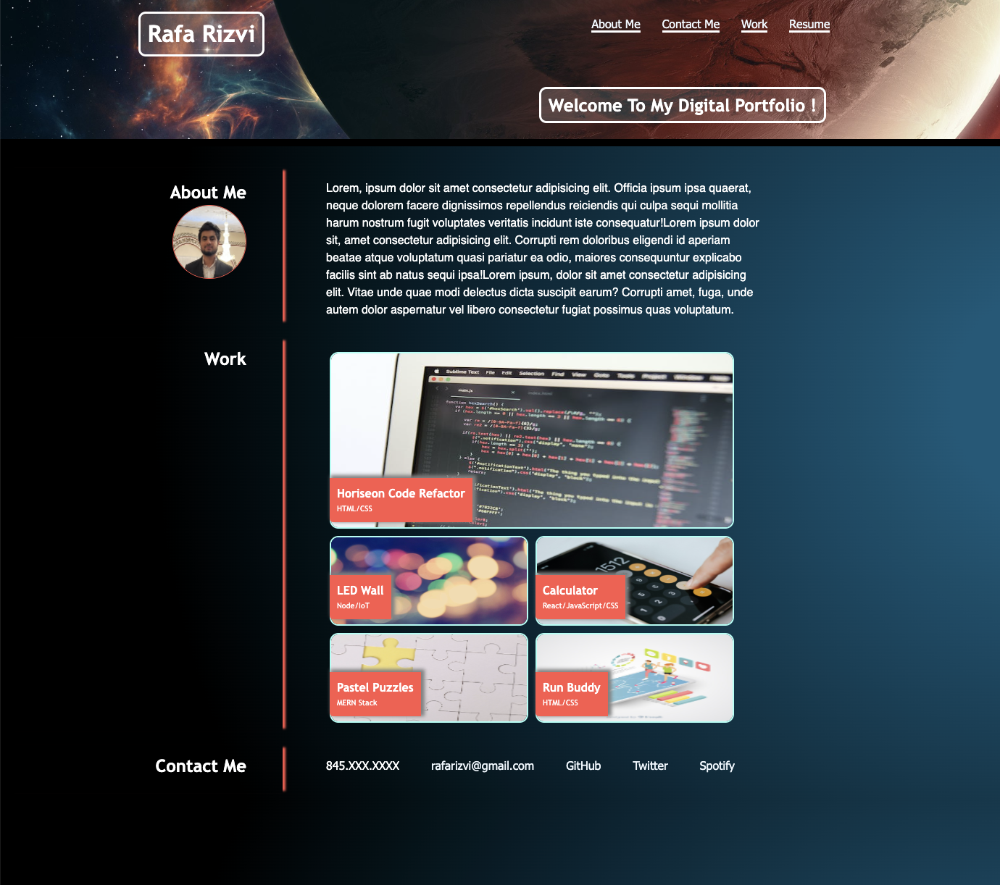

# rafa-rizvi-portfolio

## Description

#### The goal of this project was to create an online portfolio webpage to showcase my current and future web development projects.

- The portfolio is presented with my name and a photo.
- The navigation bar contains links to sections within the page. When a link is clicked the page scrolls to the corresponding section.
- In the work section, when the images showing the projects are clicked, the user is taken to the deployed project website. Currently only a single project exists.
- The layout is responsive at various screen sizes.
the webpage uses semantic elements and contains alt texts for images. 

## Installation

- N/A

## Usage

- This is an online portfolio webpage designed to showcase the projects completed during the coding bootcamp. Projects outside the bootcamp may be added as well.

## Credits

- reset file (normalization): necolas

- header image: CaptHotah, Flickr.com

- yellow puzzle image: Ann H, Pexels.com

- calculator image: Karolina Grabowska, pexels.com

- Run buddy image: Freepik.com

## License

- This project uses the MIT license.

## Badges

(https://img.shields.io/badge/made_with-HTML_CSS-blue)

## Features

- links scroll to corresponding setions of the page.
- Code uses semantic elements and is organized using using easy to follow indentation.
- contains a link to resume in nav bar. when clicked, opens a new tab and loads resume in pdf.